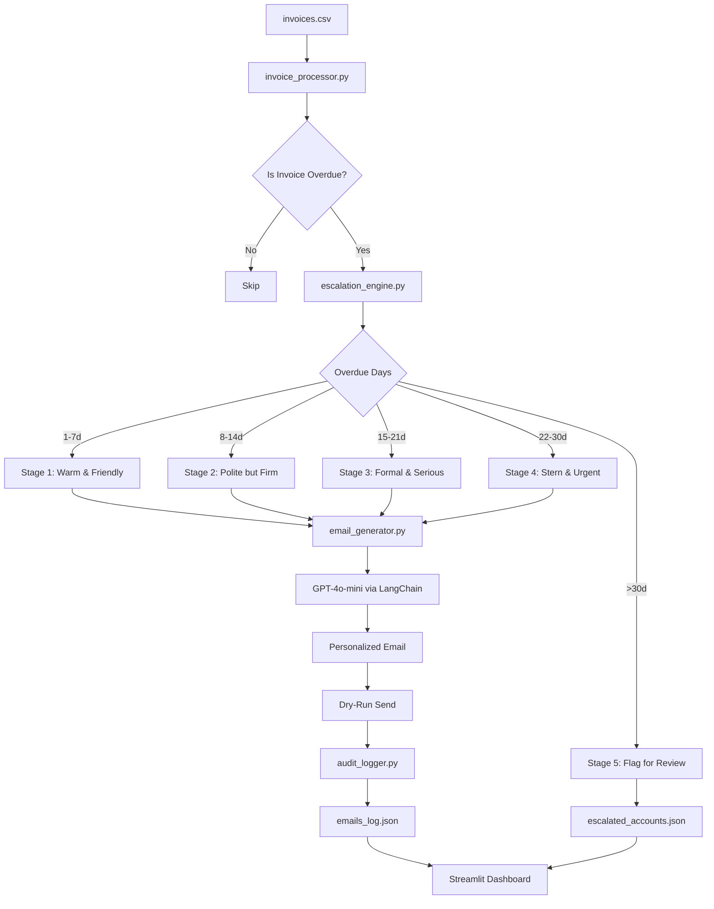

Live Demo: https://finance-followup-agent-8gg9gbhnlblatpumvesnsa.streamlit.app

# Finance Follow-Up Email Agent 

> An AI-powered prototype that automatically detects overdue invoices, determines escalation urgency, and generates personalized follow-up emails using GPT-4o-mini — all without sending a single real email.

---

##  Project Overview

Finance teams spend hours manually writing and sending payment follow-up emails. This agent automates the entire workflow:

1. **Reads** overdue invoice records from a CSV file.
2. **Detects** which invoices are past due using the current date.
3. **Classifies** each invoice into an escalation stage (1–5) based on days overdue.
4. **Generates** a fully personalized, tone-appropriate email using GPT-4o-mini.
5. **Simulates** sending (dry-run) and logs every action to JSON audit files.
6. **Flags** accounts overdue by more than 30 days for legal/manual review.

---

## Features

| Feature | Details |
|---|---|
|  Data Ingestion | Reads `invoices.csv` via pandas |
|  Overdue Detection | Dynamically calculated from current date |
|  Tone Escalation | 5-stage engine (Friendly → Legal Review) |
|  AI Email Generation | GPT-4o-mini via LangChain |
|  Dry-Run Mode | Simulates send, no real emails dispatched |
|  Audit Trail | Full JSON logs per run |
|  Escalation Cap | Accounts >30d flagged, not emailed |
|  Streamlit UI | Interactive dashboard with KPI cards |

---

## Architecture Flow



---

##  Setup Instructions

### 1. Clone the repository

```bash
git clone https://github.com/your-username/finance-followup-agent.git
cd finance-followup-agent
```

### 2. Create a virtual environment

```bash
python -m venv venv
source venv/bin/activate      # macOS/Linux
venv\Scripts\activate         # Windows
```

### 3. Install dependencies

```bash
pip install -r requirements.txt
```

### 4. Configure environment variables

```bash
cp .env.example .env
# Open .env and add your OpenAI API key:
# OPENAI_API_KEY=sk-xxxxxxxxxxxxxxxxxxxxxxxx
```

> **Note:** If you skip the API key, the app runs in **demo mode** with pre-written template emails — no LLM calls made.

### 5. Create log files (first time only)

```bash
mkdir -p logs
echo "[]" > logs/emails_log.json
echo "[]" > logs/escalated_accounts.json
```

---

## ▶️ How to Run

```bash
streamlit run app.py
```

The dashboard opens at `http://localhost:8501` in your browser.

### Steps in the UI:
1. Verify the CSV path in the sidebar (default: `data/invoices.csv`).
2. Review the invoice preview table.
3. Click **" Run Follow-Up Agent"**.
4. View generated emails, escalated accounts, and the audit log.

---

## 📁 Folder Structure

```
finance-followup-agent/
│
├── app.py                        # Streamlit UI + orchestration entry point
├── requirements.txt              # Python dependencies
├── README.md                     # This file
├── .env.example                  # Environment variable template
├── .gitignore                    # Git ignore rules
│
├── data/
│   └── invoices.csv              # Sample invoice records
│
├── logs/
│   ├── emails_log.json           # Audit trail for all email actions
│   └── escalated_accounts.json  # Accounts flagged for legal review
│
├── agents/
│   ├── escalation_engine.py      # Stage 1–5 escalation logic
│   ├── email_generator.py        # LangChain + GPT-4o-mini email generation
│   ├── audit_logger.py           # JSON log writers
│   └── invoice_processor.py     # Main pipeline orchestrator
│
├── prompts/
│   └── email_prompt.txt          # Structured LLM prompt template
│
└── utils/
    └── helpers.py                # Shared utility functions
```

---

##  LLM Choice Justification: GPT-4o-mini

| Criterion | Justification |
|---|---|
| **Cost** | ~10× cheaper than GPT-4o; ideal for high-volume invoice processing |
| **Speed** | Lower latency — suitable for real-time UI interaction |
| **Quality** | Sufficient for structured email generation with constrained prompts |
| **Context Window** | 128K tokens — handles any realistic invoice batch |
| **JSON Output** | Reliably follows structured output instructions |

---

##  Agent Framework Justification: LangChain

| Criterion | Justification |
|---|---|
| **PromptTemplate** | Structured, reusable prompt management from `.txt` files |
| **Chain composition** | `prompt | llm` pattern keeps code minimal and readable |
| **Model agnostic** | Easy to swap GPT-4o-mini for Claude or Gemini if needed |
| **Ecosystem** | Mature library with well-documented patterns |

LangChain was chosen for its clean abstraction over raw OpenAI API calls and its built-in prompt management, keeping the codebase beginner-friendly.

---

##  Prompt Design & Iteration History

### Final Prompt Structure

The prompt in `prompts/email_prompt.txt` follows a **structured instruction** pattern:

1. **Role definition** — establishes the AI as a finance collections specialist.
2. **Client details block** — injects all personalization variables.
3. **Escalation context** — explicitly states stage number and tone requirement.
4. **Tone guidelines** — one-line description per stage to anchor the model's output.
5. **Output format** — mandates strict JSON `{"subject": ..., "body": ...}` to prevent parsing failures.
6. **Negative constraints** — "no placeholders", "ready-to-send", to avoid generic output.

### Prompt Iteration Log

> Mentors asked us to document our thought process — here is the evolution:

**Iteration 1 — Naive prompt (failed)**
```
"Write a payment reminder email for {client_name} for invoice {invoice_no}."
```
*Problem:* LLM returned plain text, inconsistent format, tone was always the same regardless of stage. No subject line was generated separately.

**Iteration 2 — Added role + tone (partial fix)**
```
"You are a finance professional. Write a {tone} email reminding {client_name} to pay invoice {invoice_no}."
```
*Problem:* Tone was applied but emails were still generic. No structured output — subject line was embedded in the body. Hard to parse programmatically.

**Iteration 3 — Added JSON output format (major improvement)**
```
"Return your response as JSON: {"subject": "...", "body": "..."}"
```
*Problem:* LLM sometimes wrapped output in ```json ... ``` markdown fences, breaking `json.loads()`. Also, CTAs were inconsistent per stage.

**Iteration 4 — Final (current) prompt**
- Added explicit per-stage CTA instructions (e.g., Stage 2: "confirm payment date", Stage 3: "respond within 48 hours")
- Added code fence stripping logic in `email_generator.py`
- Added `sanitize_text()` on all inputs before prompt injection
- Added `temperature=0.4` to balance creativity vs. consistency
- Added negative rules: "no placeholders", "ready-to-send email"

*Result:* 100% parseable JSON output, stage-appropriate tone and CTA, fully personalized emails.

---

##  Security Mitigations

### 1. Prompt Injection
- All user-supplied CSV values are passed through `sanitize_text()` in `utils/helpers.py`.
- Common injection patterns (`IGNORE PREVIOUS`, `<<SYS>>`, etc.) are stripped before reaching the prompt.
- Structured `PromptTemplate` with named variables prevents direct string interpolation attacks.

### 2. Data Privacy
- Invoice CSV is processed **locally** — no data is uploaded to third-party storage.
- Only the minimum required fields (name, invoice number, amount, link) are sent to the LLM.
- Sensitive fields (e.g., full contact email) are **never included** in the LLM prompt.

### 3. API Key Exposure
- API key stored in `.env` file (never hardcoded in source).
- `.env` is listed in `.gitignore` — it will never be committed.
- `.env.example` contains only a placeholder value.

### 4. Hallucination Risk
- Structured `PromptTemplate` with explicit output format (JSON) reduces free-form generation.
- `temperature=0.4` balances creativity with predictability.
- **Human review is required before deploying real email sending** in production.

### 5. Unauthorized Access
- In production, protect the API endpoint with **API key authentication** and **rate limiting** (e.g., via AWS API Gateway, Nginx, or FastAPI middleware).
- The Streamlit app is intended for internal use only.

### 6. Email Spoofing
- **Dry-run mode** is the default — no real emails are dispatched.
- For production deployment, configure **SPF, DKIM, and DMARC** records on your sending domain.
- Use a reputable transactional email provider (SendGrid, AWS SES, Postmark).

---

##  Sample Output Screenshots

> _Screenshots from a live run of the application:_

| Screen | Description |
|---|---|
| `[Invoice Preview Table]` | Displays all CSV records with calculated overdue status |
| `[KPI Cards]` | Total, Overdue, Emails Generated, Escalated counts |
| `[Email Card — Stage 1]` | Expanded card showing friendly reminder email |
| `[Email Card — Stage 4]` | Expanded card showing urgent payment demand |
| `[Escalated Accounts]` | Red-flagged section for >30d accounts |
| `[Audit Log Table]` | Tabular view of `emails_log.json` at bottom of page |

---

##  Running Without an API Key (Demo Mode)

If `OPENAI_API_KEY` is not set or is the placeholder value, the agent automatically falls back to **demo mode**:
- Realistic template emails are generated per escalation stage.
- All other features (audit logging, escalation, UI) work identically.
- No API quota is consumed.

---

##  8-Slide Presentation Outline

### Slide 1: Title
**AI Finance Credit Follow-Up Email Agent**
Internship Project Submission | [Your Name] | [Date]

### Slide 2: Problem Statement
- Finance teams manually write 50–200+ follow-up emails per month.
- Inconsistent tone, missed escalations, delayed collections.
- High operational cost for a repetitive task.

### Slide 3: Solution Overview
- AI agent pipeline: CSV → Overdue Detection → Escalation Engine → GPT-4o-mini → Dry-Run Send.
- Architecture diagram (Mermaid flowchart from README).

### Slide 4: Escalation Engine
- 5-stage table with day ranges and tones.
- Stage 5 legal flag logic.
- Code snippet from `escalation_engine.py`.

### Slide 5: AI Email Generation
- LangChain + GPT-4o-mini architecture.
- Prompt design walkthrough.
- Sample generated email (Stage 1 vs Stage 4 comparison).

### Slide 6: Streamlit Dashboard Demo
- Screenshot of KPI cards.
- Screenshot of expandable email cards.
- Screenshot of audit log table.

### Slide 7: Security & Production Readiness
- 6 security mitigations (table format).
- Mention: dry-run mode, .env, prompt injection prevention, human review gate.

### Slide 8: Future Enhancements & Conclusion
- Real email sending via SendGrid.
- Scheduled cron execution.
- Multi-currency support.
- CRM integration (Salesforce / HubSpot).
- Conclusion: saves ~X hours/week, reduces collection cycle.

---

*Built using Python · Streamlit · LangChain · OpenAI GPT-4o-mini*
